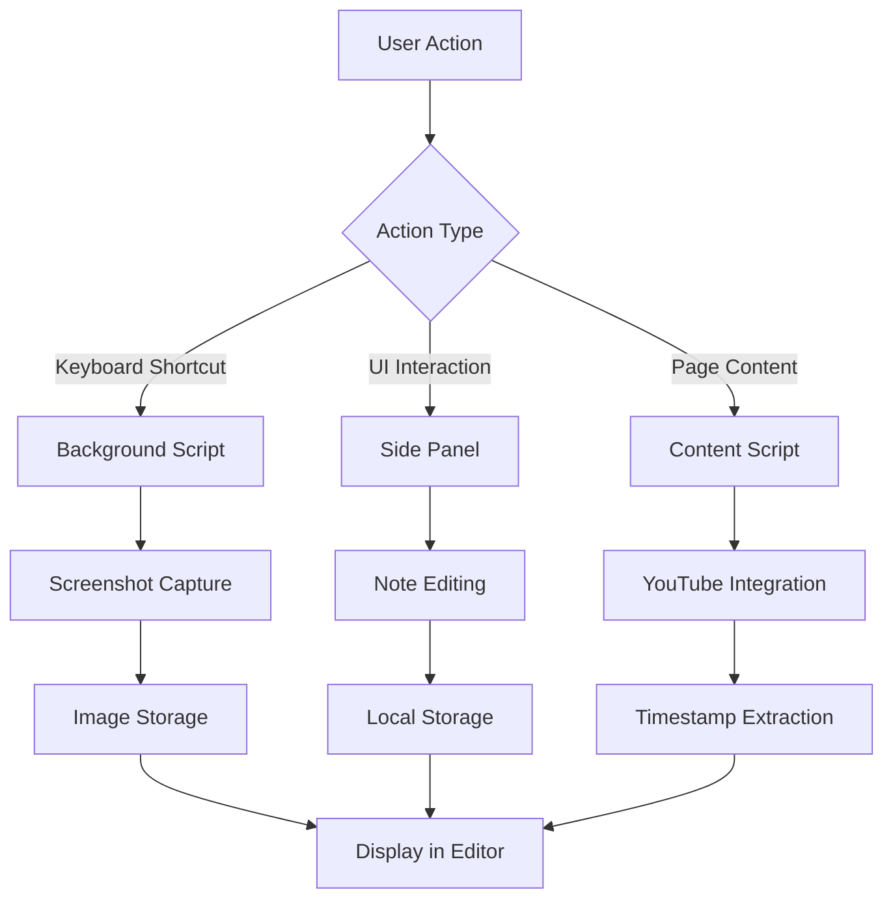

# Local Markdown Notes - Chrome Extension


A powerful Chrome extension for taking markdown notes with screenshots and YouTube timestamps, all stored locally for privacy and offline access.

## 🌟 Features

### Current Features

- **📝 Markdown Editor**: Rich markdown editing with real-time preview
- **📸 Smart Screenshots**: One-click screenshot capture with `Alt+O` keyboard shortcut
- **🎥 YouTube Integration**: Automatic timestamp extraction for YouTube videos
- **💾 Local Storage**: All notes stored locally in your browser for privacy
- **🖼️ Image Management**: Drag-and-drop image support with organized storage
- **📁 Export/Import**: Export notes as ZIP files with embedded images
- **⚡ Side Panel**: Seamless integration with Chrome's side panel API
- **🎨 Dark/Light Theme**: Adaptive UI that follows your system preferences

### YouTube-Specific Features

- **🕒 Auto-Timestamps**: Captures current video time when taking screenshots
- **📺 Video Frame Capture**: Direct video element capture for better quality
- **🔗 Smart Links**: Automatic YouTube URL integration with timestamps

## 🏗️ Architecture

### Project Structure

```file
├── manifest.json          # Extension configuration
├── background.js          # Service worker (Manifest V3)
├── content.js            # Content script for web page interaction
├── sidepanel.html        # Main UI panel
├── css/
│   └── styles.css        # Styling and themes
├── js/
│   ├── app.js           # Main application entry point
│   ├── modules/         # Feature modules
│   │   ├── screenshots.js
│   │   ├── storage.js
│   │   ├── editor.js
│   │   ├── imageManager.js
│   │   ├── preview.js
│   │   ├── fileHandler.js
│   │   └── slashPalette.js
│   └── utils/           # Utility functions
│       ├── dom.js
│       └── markdown.js
├── lib/
│   └── jszip.min.js     # ZIP file generation
└── icon16.png           # Extension icon
```

### Core Components

#### 1. Background Service Worker (`background.js`)

- **Purpose**: Handles keyboard shortcuts, tab management, and cross-tab communication
- **Key Features**:
  - Rate-limited screenshot capture to prevent API quota issues
  - Queue-based processing for rapid screenshot requests
  - Graceful error handling for connection issues
  - Chrome API integration with proper fallbacks

#### 2. Content Script (`content.js`)

- **Purpose**: Interacts with web pages, especially YouTube
- **Key Features**:
  - YouTube video timestamp extraction
  - Video element capture for better quality screenshots
  - Message passing between content and background scripts

#### 3. Side Panel UI (`sidepanel.html`)

- **Purpose**: Main user interface for note-taking
- **Key Features**:
  - Responsive markdown editor
  - Image management interface
  - Export/import controls
  - Live preview toggle

#### 4. Modular JavaScript Architecture

- **Storage Module**: Handles local data persistence
- **Editor Module**: Manages markdown editing and cursor operations
- **Screenshot Module**: Coordinates image capture and insertion
- **Image Manager**: Organizes and displays captured images
- **Preview Module**: Renders markdown with proper styling

### Data Flow



## 🚀 Future Features & Roadmap

### Phase 1: Enhanced Note-Taking (v1.1)

- **🔍 Full-Text Search**: Search across all notes with keyword highlighting
- **🏷️ Tag System**: Organize notes with custom tags and filters
- **📂 Folder Organization**: Hierarchical folder structure for better organization
- **🔗 Note Linking**: Wiki-style linking between notes
- **📋 Template System**: Pre-built note templates for different use cases

### Phase 2: Advanced YouTube Integration (v1.2)

Inspired by [YouTube Summary with ChatGPT](https://chrome.google.com/webstore/detail/youtube-summary-with-chat/nmmicjeknamkfloonkhhcjmomieiodli) and similar extensions:

- **📊 Video Analysis**:

  - Automatic chapter detection and timestamped summaries
  - Key moment identification and bookmarking
  - Video transcript integration with notes
  - Progress tracking for long videos

- **🎓 Educational Features**:
  - Lecture note templates with automatic structuring
  - Quiz generation from video content
  - Study session tracking and analytics
  - Spaced repetition reminders

### Phase 3: AI-Powered Features (v1.3)

Inspired by [Askify](https://askify.app/) and AI note-taking tools:

- **🤖 AI Writing Assistant**:

  - Content summarization and key point extraction
  - Grammar and style suggestions
  - Auto-completion for common phrases
  - Smart formatting recommendations

- **💡 Intelligent Organization**:
  - Auto-tagging based on content analysis
  - Duplicate detection and merging suggestions
  - Related note recommendations
  - Smart folder suggestions

### Phase 4: Collaboration & Sync (v1.4)

- **☁️ Cloud Sync**: Optional cloud backup and sync across devices
- **👥 Sharing Features**: Share notes with team members or publicly
- **📝 Collaborative Editing**: Real-time collaboration on shared notes
- **💬 Comments & Annotations**: Add comments and discussions to notes

### Phase 5: Advanced Capture & Integration (v1.5)

- **🌐 Multi-Platform Support**:

  - Twitter thread capture and formatting
  - Reddit post and comment extraction
  - GitHub repository documentation capture
  - Academic paper annotation and note-taking

- **📱 Cross-Device Features**:
  - Mobile companion app
  - Desktop application sync
  - Browser bookmark integration
  - Email integration for note sharing

### Phase 6: Professional Features (v2.0)

- **📈 Analytics Dashboard**:

  - Note-taking patterns and productivity insights
  - Time spent on different topics
  - Learning progress tracking
  - Goal setting and achievement tracking

- **🔧 Advanced Customization**:
  - Custom CSS themes and layouts
  - Keyboard shortcut customization
  - Plugin system for third-party integrations
  - Advanced export formats (LaTeX, PDF, etc.)

## 🛠️ Technical Improvements

### Performance Optimizations

- **Lazy Loading**: Load modules and images only when needed
- **Virtual Scrolling**: Handle large note collections efficiently
- **Caching Strategy**: Implement intelligent caching for better performance
- **Compression**: Optimize image storage and note data

### Security & Privacy

- **Encryption**: Optional local encryption for sensitive notes
- **Privacy Controls**: Granular control over data collection
- **Audit Logs**: Track data access and modifications
- **Secure Export**: Encrypted export options

### Developer Experience

- **TypeScript Migration**: Gradual migration to TypeScript for better type safety
- **Testing Framework**: Comprehensive unit and integration tests
- **CI/CD Pipeline**: Automated testing and deployment
- **Documentation**: Detailed API documentation and contribution guidelines

## 🎯 Competitive Analysis

### Comparison with Popular Extensions

| Feature                 | Local Markdown Notes | Askify         | YouTube Notes  | Notion Web Clipper |
| ----------------------- | -------------------- | -------------- | -------------- | ------------------ |
| **Privacy**             | ✅ Fully Local       | ❌ Cloud-based | ❌ Cloud-based | ❌ Cloud-based     |
| **Offline Access**      | ✅ Complete          | ❌ Limited     | ❌ Limited     | ❌ Limited         |
| **YouTube Integration** | ✅ Advanced          | ⚠️ Basic       | ✅ Advanced    | ⚠️ Basic           |
| **Markdown Support**    | ✅ Native            | ⚠️ Limited     | ❌ None        | ⚠️ Basic           |
| **Image Capture**       | ✅ Advanced          | ⚠️ Basic       | ✅ Good        | ⚠️ Basic           |
| **Export Options**      | ✅ ZIP/MD            | ⚠️ Limited     | ⚠️ Limited     | ✅ Multiple        |
| **Free Tier**           | ✅ Unlimited         | ⚠️ Limited     | ⚠️ Limited     | ⚠️ Limited         |

### Unique Selling Points

1. **Complete Privacy**: No data ever leaves your device
2. **True Offline Functionality**: Works without internet after installation
3. **Developer-Friendly**: Open architecture for customization
4. **No Subscription**: One-time installation, lifetime use
5. **Fast Performance**: Local storage means instant access

## 🔧 Installation & Development

### For Users

1. Download the extension from Chrome Web Store (coming soon)
2. Or load as unpacked extension for development:
   - Clone this repository
   - Open Chrome → Extensions → Enable Developer Mode
   - Click "Load unpacked" and select the extension folder

### ⌨️ Setting Up Keyboard Shortcuts (Important for Chrome Users)

**Chrome requires manual keyboard shortcut configuration**:

1. Navigate to `chrome://extensions/shortcuts` in your browser
2. Find "Local Markdown Notes" in the list
3. Click in the shortcut field next to "Capture screenshot of video or page"
4. Press your desired key combination (recommended: **Option+O** / **Alt+O**)
5. The shortcut is now active!

**Why is this needed?**
Chrome extensions cannot programmatically set keyboard shortcuts for security reasons. On Chrome (unlike Brave), Alt+letter combinations are used for special characters by default, so manual configuration ensures the shortcut works properly.

**Alternative shortcuts if Option+O doesn't work**:

- `Command+Shift+O` (Mac) / `Ctrl+Shift+O` (Windows/Linux)
- `Command+Shift+S` (Mac) / `Ctrl+Shift+S` (Windows/Linux)
- Any other combination you prefer!

### For Developers

```bash
# Clone the repository
git clone https://github.com/mohit07raghav19/Local-Markdown-Notes.git
cd Local-Markdown-Notes

# Load in Chrome
# 1. Open chrome://extensions/
# 2. Enable "Developer mode"
# 3. Click "Load unpacked"
# 4. Select this directory
```

### Development Guidelines

- Follow the modular architecture pattern
- Add comprehensive error handling
- Include logging for debugging
- Test across different YouTube video types
- Ensure accessibility compliance

## 📄 License

MIT License - Feel free to fork, modify, and distribute

## 🤝 Contributing

We welcome contributions! Areas where help is needed:

- 🐛 Bug fixes and testing
- 🎨 UI/UX improvements
- 🌐 Internationalization
- 📚 Documentation
- 🧪 Testing automation
- 🚀 Feature development

## 📞 Support

- **Issues**: [GitHub Issues](https://github.com/mohit07raghav19/Local-Markdown-Notes/issues)
- **Discussions**: [GitHub Discussions](https://github.com/mohit07raghav19/Local-Markdown-Notes/discussions)
- **Email**: [support@localmarkdownnotes.com](mailto:support@localmarkdownnotes.com)

---

Built with ❤️ for privacy-conscious note-takers and YouTube learners
